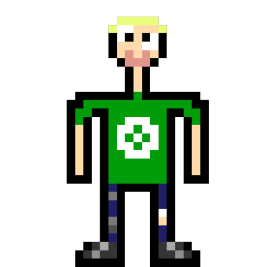
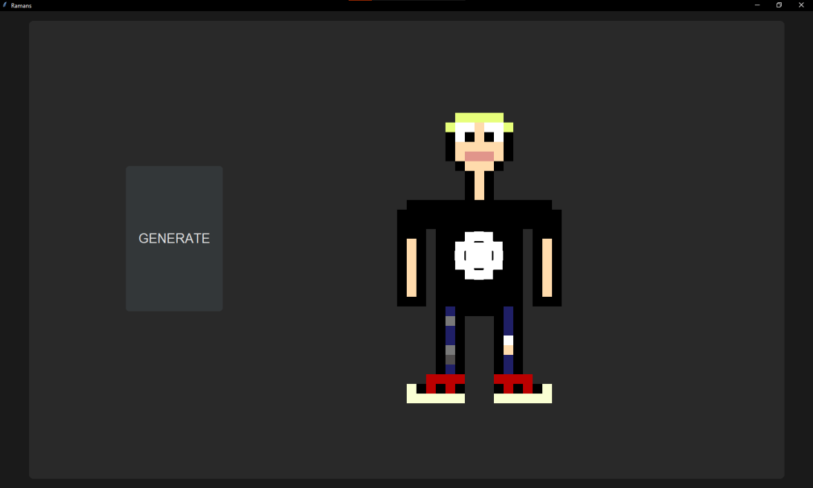

# Ramans
> Developers MorVo1 and Tom-Z15\
Tom-Z15 - GUI, MorVo1 - backend

### Ramans is a generator of pixelart little men made in python.
#

## Requirements
If you want to use our app you'll need: tkinter and pillow

## How to use it?
- Download our repository and `cd` to it.
- `cd` to the `src` folder.
- If you want to open in GUI mode run app.py
- If you want to open in console mode run main.py
- Your raman will be in `out.png` file. 
- Have fun!

## GUI preview
